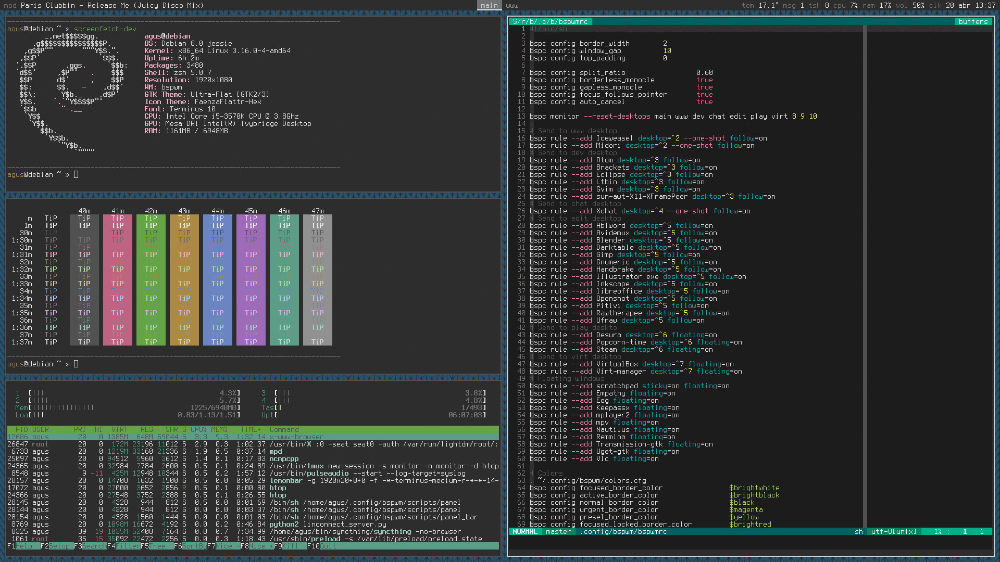

# bspwm configuration

## About

This repository stores my configuration of [bspwm][bspwm], *a tiling window
manager based on binary space partitioning*, and [sxhkd][sxhkd], *a simple X
hotkey daemon*.
Forked from https://github.com/aguslr/bspwm-config.

## Demo

[bspwm]: https://github.com/baskerville/bspwm
[sxhkd]: https://github.com/baskerville/sxhkd
[stow]: https://www.gnu.org/software/stow/
